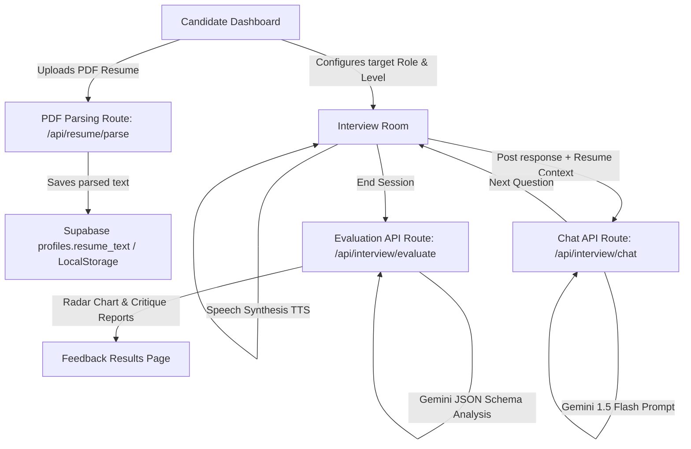

# AI Interview Simulator MVP

An advanced, dark-themed responsive web application built with **Next.js 15 (App Router)** that conducts personalized technical mock interviews. It translates user answers in real-time using browser speech-to-text, queries the **Gemini 1.5 Flash API** to generate empathetic yet rigorous follow-up questions, speaks responses using speech-synthesis, and provides structured evaluation reviews with **Recharts Radar visual charts**.

---

## Technical Stack & Badges


---

## Architecture Overview



1. **Dashboard & Customization**: Configure target roles (e.g. Frontend Developer), select experience levels (Junior, Mid, Senior, Lead), and drag-and-drop a PDF resume to personalize questions.
2. **Interactive Room**: Features a real-time canvas-based audio visualizer (using the browser's Web Audio API `AnalyserNode`), ticking 15-minute countdown timers, and glassmorphic conversation transcripts.
3. **AI Chat Pipeline**: Translates client audio streams, extracts resume keywords (e.g. TypeScript, Docker), and prompts Gemini to ask targeted, concise situational and code-oriented technical questions.
4. **Structured JSON Analysis**: Translates chat history transcripts into scores and strengths utilizing Gemini schemas.

---

## Core Features

- 🎙️ **Real-Time Speech-to-Text**: Voice-to-text transcribing directly inside the browser using the browser-native `webkitSpeechRecognition` API.
- 🔊 **Auto-Play Voice Synthesis**: Utters AI questions out loud using browser native `speechSynthesis`.
- 📂 **Drag-and-Drop PDF Parsing**: Drag-and-drop a PDF resume, parse it server-side using `pdf-parse`, and persist the data in Supabase.
- 🎨 **Modern Micro-interactions**: Smooth page layout transitions, pulsing microphone buttons, and a Canvas-based frequency visualizer.
- 📊 **Dynamic Competency Radar**: Renders technical accuracy, communication, and problem-solving metrics side-by-side using Recharts.

---

## Environment Variables Configuration

Create a `.env.local` file in the root directory:

```env
# Supabase Integration keys (Auth and DB client initialization)
NEXT_PUBLIC_SUPABASE_URL=https://your-project.supabase.co
NEXT_PUBLIC_SUPABASE_ANON_KEY=eyJhbGciOiJIUzI1NiIsInR5cCI6IkpXVCJ9...

# Google Gemini API key (Mock simulator is used automatically if placeholder is left)
GEMINI_API_KEY=AIzaSy...
```

### Production Variable Fallbacks
- **`NEXT_PUBLIC_SUPABASE_URL` & `NEXT_PUBLIC_SUPABASE_ANON_KEY`**: Required for profiles, session histories, and authentication modules.
- **`GEMINI_API_KEY`**: If this variable is missing or contains the word `placeholder`, the simulator automatically executes a realistic **Mock Fallback Simulator** which lets users test the dashboard and interview flow.

---

## Local Setup & Build Instructions

### 1. Install Dependencies
```bash
npm install
```

### 2. Database Migrations
Run the schema initialization query found in [supabase/schema.sql](file:///d:/AI%20Projects/ai-interview-simulator/supabase/schema.sql) in your Supabase SQL editor.

### 3. Run Development Server
```bash
npm run dev
```
Navigate to `http://localhost:3000` to review the application.

### 4. Build for Production
Verify compilation and static page generation before deploying to Vercel/Netlify:
```bash
npm run build
```
