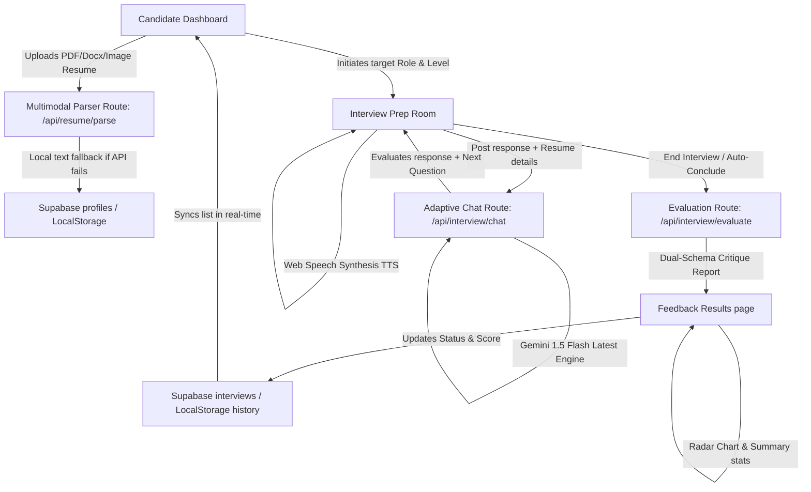

# AI Interview Simulator - Debate-Style Prep Platform

🔗 **Live Demo:** 
                [ai-interview-simulator-19vv.vercel.app](https://ai-interview-simulator-19vv.vercel.app/)

An advanced, dark-themed responsive web application built with **Next.js 15 (App Router)** that conducts personalized, debate-style mock technical interviews. By analyzing the candidate's resume, the platform structures realistic production scenario questions, tracks and grades response accuracy in real-time, probes on partial answers, and provides visual evaluation critiquing using **Recharts Radar charts**—powered by **Gemini 2.5 Flash / 1.5 Flash Latest API**.

---

## Technical Stack & Badges


---

## Architecture Overview



1. **Dashboard & Customization**: Configure target roles (e.g. Frontend Developer), select experience levels (Junior, Mid, Senior, Lead), and drag-and-drop a PDF, docx, image, or text resume to personalize questions.
2. **Interactive Room**: Features a real-time canvas-based audio visualizer (using the browser's Web Audio API `AnalyserNode`), ticking 15-minute countdown timers, and glassmorphic conversation transcripts.
3. **AI Chat Pipeline**: Translates client audio streams, extracts resume keywords (e.g. TypeScript, Docker), and prompts Gemini to ask targeted, concise situational and code-oriented technical questions.
4. **Structured JSON Analysis**: Translates chat history transcripts into scores and strengths utilizing Gemini schemas.

---

## Key Features

- 📄 **Smart PDF Resume Parsing**: Drag-and-drop file uploader accepting PDFs, Word documents (`.docx`), images, and raw text files. Powered by `mammoth` and Gemini multimodal OCR inline base64 data to extract skills, project involvement, and professional summaries.
- 🎯 **Live Per-Question Accuracy Rating**: For every single user answer, the AI calculates an accuracy score (0-100%) and provides immediate, constructive feedback formatted right inside the transcript.
- ⚔️ **Adaptive Debate & Probing Mode**: If a response scores below 80%, the AI Senior Lead Engineer persona retains the current scenario question, challenging the candidate's logic or asking them to debug further until they resolve it or choose to skip.
- 🎙️ **Voice & Speech Integration**: Real-time browser-native speech-to-text transcription (`webkitSpeechRecognition`) coupled with custom-modulated speech synthesis (`speechSynthesis`) for a completely hand-free, immersive mock interview session.
- 📊 **Dynamic Competency Radar Charts**: Leverages `Recharts` to draw polar radar graphs grading candidate performance across Technical Accuracy, Communication, and Problem Solving based on their responses.
- 📂 **Dashboard & History Management**: A comprehensive simulated session history list that syncs results in real-time from Supabase and `localStorage`. Features session status tags, cumulative score averages, session resuming options, and instant session deletes.

---

## Environment Variables Configuration

Create a `.env.local` file in the root directory:

```env
# Supabase Integration keys (Auth and DB client initialization)
NEXT_PUBLIC_SUPABASE_URL=https://your-project.supabase.co
NEXT_PUBLIC_SUPABASE_ANON_KEY=eyJhbGciOiJIUzI1NiIsInR5cCI6IkpXVCJ9...

# Google Gemini API key (Mock simulator is used automatically if placeholder is left)
GEMINI_API_KEY=AIzaSy...
```

### Production Variable Fallbacks
- **`NEXT_PUBLIC_SUPABASE_URL` & `NEXT_PUBLIC_SUPABASE_ANON_KEY`**: Required for profiles, session histories, and authentication modules.
- **`GEMINI_API_KEY`**: If this variable is missing or contains the word `placeholder`, the simulator automatically executes a realistic **Mock Fallback Simulator** which lets users test the dashboard and interview flow.

---

## Local Setup & Build Instructions

### 1. Install Dependencies
```bash
npm install
```

### 2. Database Migrations
Run the schema initialization query found in [supabase/schema.sql](file:///d:/AI%20Projects/ai-interview-simulator/supabase/schema.sql) in your Supabase SQL editor.

### 3. Run Development Server
```bash
npm run dev
```
Navigate to `http://localhost:3000` to review the application.

### 4. Build for Production
Verify compilation and static page generation before deploying to Vercel/Netlify:
```bash
npm run build
```
